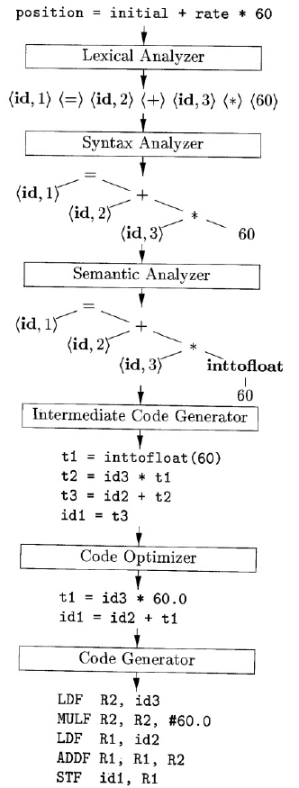

# 编译原理

2022春 编译原理课程复习笔记

## 编译器



编译的步骤：

1. 词法分析
2. 语法分析
3. 语义分析
4. 中间代码生成
5. 代码优化
6. 代码生成

## 上下文无关文法

Context Free Grammar

- 一个终结符号集合 terminal (if, else, "(", ")")
- 一个非终结符号集合 nonterminal
- 一个产生式集合
- 一个开始符号

```
stmt -> if ( expr ) stmt else stmt
```

语法分析树 - 二义性（两个语法树）

运算符的优先级 -> 通过文法定义来实现

语法制导定义 (syntax-directed definition)

- 语法制导定义将字符串作为属性附加到语法分析树的各结点上
- 语法制导翻译⽅案通过语义动作，将翻译结果递增地打印出来，不需要附加
  空间来存放⼦表达式的翻译结果

## 语法分析

推导，最左推导，最右推导


