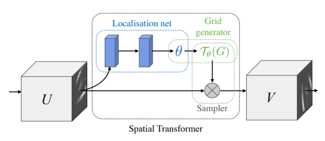
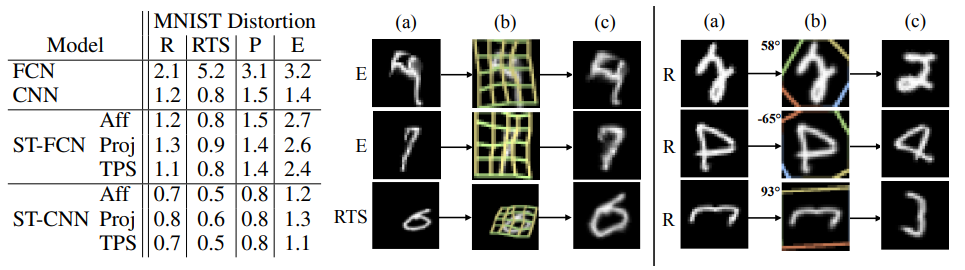

# Deep Learning

Note: this note contains the note collection related to deep learning field

## Spatial Transformer

From DeepMind, 2015 NIPS, [paper link](https://proceedings.neurips.cc/paper/2015/hash/33ceb07bf4eeb3da587e268d663aba1a-Abstract.html)

[Youtube link from Hung-yi Lee](https://www.youtube.com/watch?v=SoCywZ1hZak)

Rotation, scaling invariable CNN (add a spatial transformer, ST)

Model architecture:

Performance:

